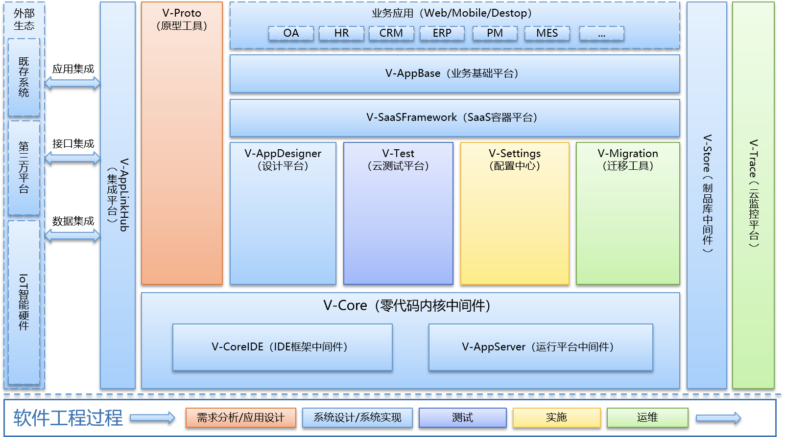

# 总体描述

V平台是一个完整的，面向业务人员的，全周期的零代码应用软件开发平台，可简化、降低应用软件开发门槛和优化交付过程的每个阶段。业务开发人员和团队可以按照市场需求，高效的提供业务所需的应用软件。

无论应用软件规模的大小，开发团队都会涉及需求、设计、开发、质量检查以及分析和管理其所开发的应用软件。V平台提供了涵盖了完整的支撑应用软件前端和后端需求的功能构件。它还提供了应对应用软件部署​​和长期维护的完整工具套件。无需像传统开发一样将单独的工具拼凑在一起，这会增加成本并降低生产率。并且，我们配套提供项目治理和决策分析工具，以支撑大型项目可以按需扩大项目资源规模而无需担心管理覆盖的问题。

零代码应用软件交付是V平台的核心能力，除此之外我们还提供了更多赋能应用软件开发过程的辅助能力。目标是通过提供以下功能来支撑连续交付而不中断应用软件开发过程，从而整体降低成本和风险：

**高效的生产力：**应用软件的开发不再是数以月计，而是在数周内创建自己的应用并进行集成。

**开发速度和传统代码：**使用可视化建模的可扩展性，效率和开发速度，同时保留了集成自定义代码的完全灵活性。

**多平台部署：**开发人员使用可视化建模来开发可以在任何常见设备或平台上运行的应用软件。借助自动化部署，可显着降低风险，开发时间和成本。

**开放平台：**通过与现有系统的集成来保护历史业务系统的投资，通过元语言的增强来保护历史技术构件的投资。

**企业级协同平台：**像单个应用软件一样轻松，快速地构建和管理由开发人员团队创建的大量应用软件组合。

**降低成本：**通过自动依赖性管理和整体应用软件生命周期管理（ALM），将应用软件维护成本降低到一小部分。

**无需锁定供应商：**启用V平台所开发的应用软件不需要运行时解释器或引擎。我们生成具有标准架构的应用，可以运行在公开的标准架构或标准的应用容器中，不用担心被供应商绑定。

