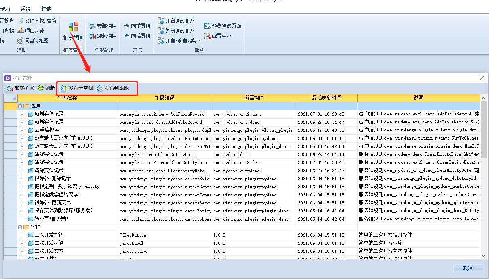

# 发布插件

### 正式发布

调试通过后，需要使用正式步骤发布

打包好jar后，就要使用V-AppDesigner进行构件的部署，[《零代码软件开发工具套件》](http://www.yindangu.com/module-operation!executeOperation?componentCode=yindangu_officialwebsite&windowCode=Form_Product_VDevSuite&token=%7B%22data%22%3A%7B%22inputParam%22%3A%7B%22variable%22%3A%7B%22formulaOpenMode%22%3A%22locationHref%22%7D%7D%7D%7D)

【发布云空间】编译成功后，可以直接提交到对应的任务的。

【发布到本地】编译成功后，把jar包下载到本地。

返回每个插件的状态,只要有一个不成功，就整个构件发布不成功

### 调试发布

日常开发构件，每次修改代码调试都使用"正式发布"步骤操作比较繁琐，调试发布的作用是把"正式发布"的步骤合并一起完成，它的作用就是把编译、安装到执行系统一步完成。具体操作：

登录执行系统后台，进入云编译功能：

### 调试发布模式限制条件

这个功能只在开发阶段生效，是为了避免构件受控问题。

项目开发时，使用VBOX打包一个开发阶段的项目就可以了，另外由于“**本地项目**"只有正式阶段的版本，后期将对“**本地项目**"进行针对处理。

发布插件不需要重启的，包括前端、后端插件都不需要重启。只有插件使用了静态资源，卸载也不能释放的情况才需要重启。

