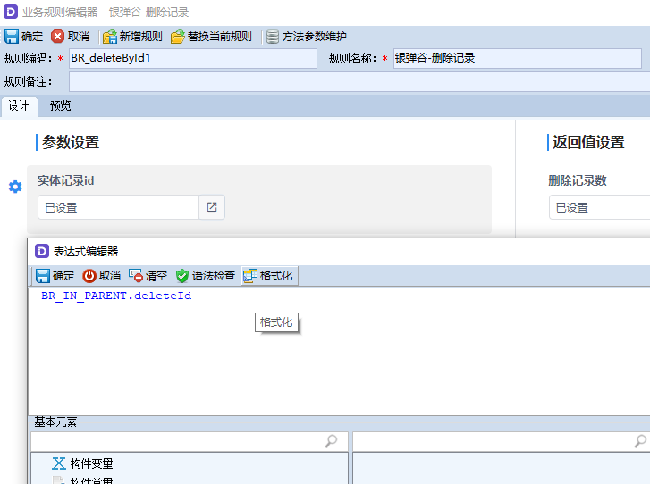
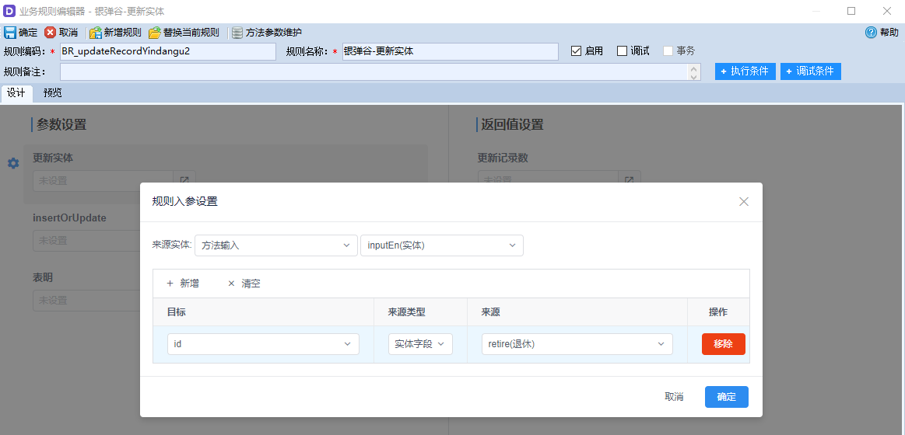
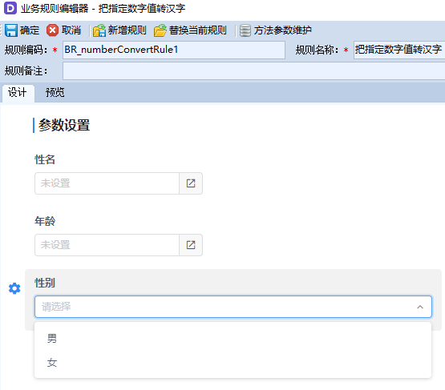

# 参数编辑器

## 表达式编辑器

表达式编辑器，是最常用的编辑器，它可以输入常量、变量、函数等表达式，如果没有指定编辑器类型，系统默认使用表达式编辑器。如果参数是实体类型，就默认使用实体编辑器。

```java
IEditorBuilder editorBuild2 = RegVds.getBuilder().getEditorBuilder();
IRuleBuilder.IRuleInputBuilder inputParamField = br.newInput()
		.setCode(NumberUpperRolueEntity.INPUT_AGE)
		.setName("转换列名")
		.setType(VariableType.Char)
		//表达式编辑器 可以省略
		.setEditor(editorBuild2.setType(EditorType.Expression).build());
```

对应开发系统的效果



## 实体编辑器

插件入参需要实体作为参数时，就要使用实体编辑器。

下面例子定义实体参数，有3个实体字段，使用实体编辑器。

```java
// 添加规则元信息(把指定列 数字转汉字)
IRuleBuilder br2 = RegVds.getPlugin().getRulePlugin();
//实体构造器
IEntityBuilder entryBuild = RegVds.getBuilder().getEntityProfileBuilder();
//编辑器构造器
IEditorBuilder editorBuild1 = RegVds.getBuilder().getEditorBuilder();

//参数构造器（定义实体编辑框、及实体字段）
IRuleBuilder.IRuleInputBuilder inputParamEntry = br.newInput().setCode(NumberUpperRolueEntity.INPUT_USERLLIST)
		.setName("用户列表").setType(VariableType.Entity).setEditor(editorBuild1.setType(EditorType.EntityField).build())				
		.addField(entryBuild.newField().setCode("age").setName("年龄").setType(VariableType.Integer).build())
		.addField(entryBuild.newField().setCode("name").setName("性名").setType(VariableType.Char).build())
		.addField(entryBuild.newField().setCode(NumberUpperRolueEntity.FD_CHINESE).setName("汉字大写").setType(VariableType.Char).build());
		
IPluginProfileVo p4 = br2.setCode(NumberUpperRolueEntity.D_Code).setName("把指定列 数字转汉字-entity")
				.setDesc("把指定列 数字转汉字-实体").setAuthor("徐刚")
				.addInput(inputParamEntry.build())		
```

对应的效果



## 下拉选择编辑器

下拉选择编辑器，对于枚举类型，及指定值的参数。

例如参数“性别”定义描述，NumberUpperRolue.Sex.male，NumberUpperRolue.Sex.female就是枚举值

```java
//定义编辑器，及选项
IEditorBuilder editBuild = RegVds.getBuilder().getEditorBuilder();
editBuild.setType(EditorType.Select)
		.addOption(editBuild.newOption().setLabel("男").setValue(NumberUpperRolue.Sex.male.name()).build())
		.addOption(editBuild.newOption().setLabel("女").setValue(NumberUpperRolue.Sex.female.name()).build());

//设置入参的编辑器
IRuleBuilder.IRuleInputBuilder inputParamSex =
		br.newInput()
		.setCode(NumberUpperRolue.INPUT_SEX)
		.setName("性别")
		.setType(VariableType.Char)
		.setEditor(editBuild.build());

//设置插件入参
IPluginProfileVo p2 = br.setCode(NumberUpperRolue.D_Code).setName("把指定数字值转汉字").setAuthor("徐刚")
		.setDesc("把指定数字值转汉字desc")
		.addInput(inputParamSex.build());
```

开发系统对应的效果



