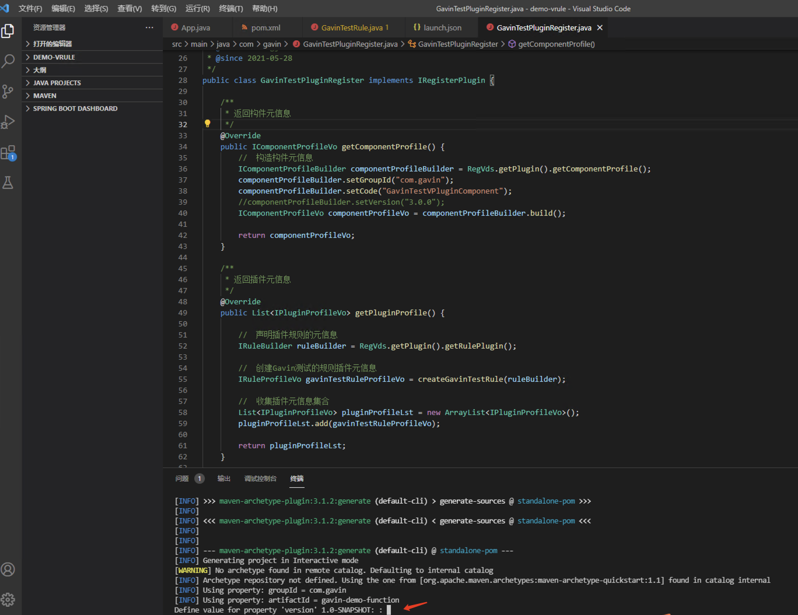
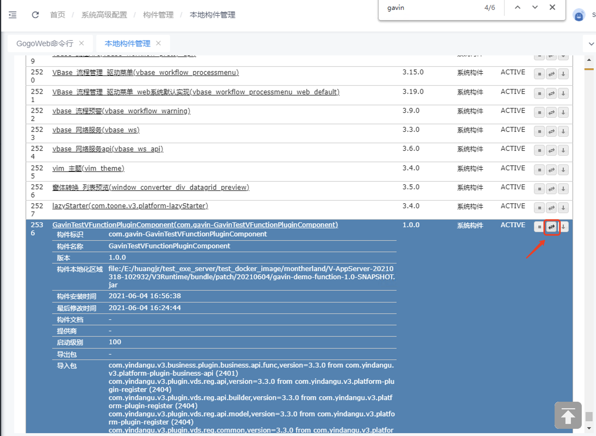

# VSCode实战

## **1. 添加银弹谷maven私库地址**

* 在VSCode的“设置”这里找到maven的settings.xml文件，具体路径以当前环境安装maven路径为准


* 在maven的settings.xml中添加银弹谷maven私库地址信息

```text
<profile>
	<id>codingProxy</id>
	<activation>
		<activeByDefault>true</activeByDefault>
	</activation>
	<repositories>
		<repository>
			<id>yindangu-v-devsuite-sdk-maven</id>
			<name>maven</name>
			<url>https://yindangu-maven.pkg.coding.net/repository/v-devsuite-sdk/maven/</url>
			<releases>
				<enabled>true</enabled>
			</releases>
			<snapshots>
				<enabled>true</enabled>
			</snapshots>
		</repository>
	</repositories>
</profile>
```


## 2. 创建maven项目

* VSCode界面上键盘按下Ctrl+Shift+P
* 弹出的输入框输入"maven"
* 选择Create Maven Project


* 选择maven-archetype-quickstart


* 选择1.4


* 填入能够唯一标识自己企业/开发团队/开发者的编码作为groupId，用于在软件运行时区分不同厂商、开发者的插件


* 填入能够唯一标识插件的编码作为artifactId，用于在软件运行时区分不同插件，这里演示的例子填入了用于演示的demo函数


* 选择这个maven project存放的本地磁盘目录


* 确认maven project的版本号，这个版本号对于V-DevSuite没什么用处，本例子直接按回车键Enter，产生1.0-SNAPSHOT



* 确认maven project的元信息，本例子直接按Enter回车键，直接生成maven工程


* 选择“将文件夹添加到工作区”，加载刚才创建的maven project


## 3. 添加maven依赖

* 打开工程中的pom.xml文件，建议把build节点中的plugins替换成这个，如果已有其他plugin的可以同时保留

```text
<plugins>
	<plugin>
		<groupId>org.apache.maven.plugins</groupId>
		<artifactId>maven-compiler-plugin</artifactId>
		<configuration>
			<source>1.8</source>
			<target>1.8</target>
		</configuration>
	</plugin>
	<plugin>
		<!-- 把依赖的包导出来，方便发布构件时选择 -->
		<groupId>org.apache.maven.plugins</groupId>
		<artifactId>maven-dependency-plugin</artifactId>
		<executions>
			<execution>
				<id>copy</id>
				<phase>package</phase>
				<goals>
					<goal>copy-dependencies</goal>
				</goals>
				<configuration>
					<outputDirectory>${project.build.directory}/lib</outputDirectory>
				</configuration>
			</execution>
		</executions>
	</plugin>
</plugins>
```


* pom.xml中的dependency节点，即maven依赖模块，必须要填入以下依赖，如果插件开发的代码需要用到其他第三方的maven依赖jar的，也需要加入，并且把这些第三方依赖jar放到当前工程编译后的jar包的lib目录下，不然插件运行时会因为找不到第三方依赖jar而报错。

```text
<dependency>
	<groupId>com.yindangu.v3.platform</groupId>
	<artifactId>plugin-business-api</artifactId>
	<version>3.3.0</version>
</dependency>
<dependency>
	<groupId>com.yindangu.v3.platform</groupId>
	<artifactId>plugin-register</artifactId>
	<version>3.3.0</version>
</dependency>
<dependency>
	<groupId>com.yindangu.v3.platform</groupId>
	<artifactId>plugin-utils</artifactId>
	<version>3.3.0</version>
</dependency>
```


## 4. 后台函数的开发示例

* 这里演示二次开发后台函数，编写后台函数的主要代码逻辑


## 5. 插件注册器的开发示例

* 实现插件注册器，用于声明当前构件（即模块）需要安装运行的插件的元信息


* 本例子实现后台函数，这里是函数的输入、输出参数的元信息声明，用于注册函数插件信息


## 6. 编译maven工程

* 插件开发完成，执行maven install


## 7. 把原始jar包部署到云空间

* 找到maven install之后在项目的target目录下产生的jar文件，准备做后面上传云空间使用


* 安装最新版的开发系统V-AppDesigner，点击扩展管理，把编译后的jar上传到云空间（也可以放不到本地，用于本地环境调试，后面的步骤会介绍）


* 发布到云空间需要选择当前云空间项目的vteam任务单，操作流程与配置构件的部署云空间相同，选择vteam任务单是为了能够知道当前构件的部署是基于什么任务提交的


* 确认上传后有界面返回编辑结果是成功，证明插件全部上传成功，否则会返回异常原因，需要按照异常提示调整好插件代码重新编译上传


## 8. 在V-AppDesigner中使用插件

* 成功上传插件到云空间后，因为这个例子是开发了一个后台函数插件，开发系统需要使用这个新开发的函数进行配置，所以需要点击这个图标，更新当前项目为云空间上最新版，才能把刚上传的插件安装到当前项目中


* 更新云空间之后，就可以在开发系统中使用刚安装的二次开发的后台函数插件了


## 9. 在开发环境调试代码

* 插件开发人员如果想在部署到云空间之前做开发自测，可以把插件安装到本地，然后拷贝到本地的用于开发人员自测的执行系统的patch，进行开发自测

选择“发布到本地”-&gt;点击“原生包选择”的文件选择按钮-&gt;选中maven install后的本地jar包-&gt;点击“目标存储”的文件选择按钮-&gt;选中硬盘某一个目录存放云编译后的增强jar包（只有经过云编译增强的jar包才可以在V-AppServer执行系统中运行）


开发自测插件的时候，可以把增强后的jar包放到V-AppServer执行系统的patch目录下


### 9.1 首次安装插件调试

* 进入配置中心的gogo命令执行页面，首次本地安装构件，执行install命令

命令格式举例：install file:/E:/huangjr/test\_exe\_server/test\_docker\_image/montherland/V-AppServer-20210318-102932/V3Runtime/bundle/patch/20210604/gavin-demo-function-1.0-SNAPSHOT.jar

其中file:后面是前面经过云编译增强保存到本地的jar文件的磁盘路径


* 执行完install后，记住返回的bundle ID，接着执行start 命令，启动构件

命令格式如：start 2536


* 这时候可以进入“本地构件管理”窗体，查找刚安装的插件，注意插件名称为插件开发时候注册定义的构件编码，显示已安装的构件已经是active状态，即已经安装并启动成功，可以直接运行使用


### 9.2 动态更新插件调试

* 如果之前已经安装构件，则放到patch目录之后，点击“本地构件管理”对应构件的更新按钮，刷新构件到最新，更新完可以查看构件的最后修改时间应该是覆盖到patch目录的增强jar包的产生时间，构件安装时间是刚点击更新按钮的时间。



### 9.3 简化的构件调试方式

把原始jar包上传云编译服务、安装构件、执行系统更新构件的步骤集成在执行系统中，执行一步操作就完成所有动作。

注意：这个功能只是为调试时能快速发布到执行系统的开发环境，故只对项目的开发阶段开放，调试完毕后需要正式发布构件到云仓库，请使用开发系统发布构件的功能。

具体操作步骤：

打个包过程是跟平常一样，使用maven或其他工具打包成标准jar包，详细参考【把原始jar包部署到云空间】这一章节的内容。打包好标准jar文件后，请登录到执行系统配置中心的V-DevSuite扩展插件菜单中编译并安装（更新） jar文件，[http://IP:PROT/system/settings/index.html\#/portal/:-system-console-vpluginManager](http://10.1.28.163:8080/system/settings/index.html#/portal/:-system-console-vpluginManager)


上传jar包后编译没有问题就自动安装到执行系统。成功后有"**构件更新成功！**"文字。

### 9.4 远程调试代码

* 使用VSCode远程调试后台规则、函数

添加远程调试的ip地址与端口的配置，点击“运行和调试”右边的箭头

函数设置断点之后，运行函数，就会进入对应的断点，可以进行远程调试了


## 附：后台函数、规则示例源码

[后台函数的demo源码工程\(20210604\)](http://download.yindangu.com/yindangu-plugin/plugin-demo/20210430/demo-function-20210604.zip)

[后台规则的demo源码工程\(20210604\)](http://download.yindangu.com/yindangu-plugin/plugin-demo/20210430/demo-vrule-20210604.zip)

_\(注：若点击无法下载，请右键选择“链接另存为”进行下载\)_

