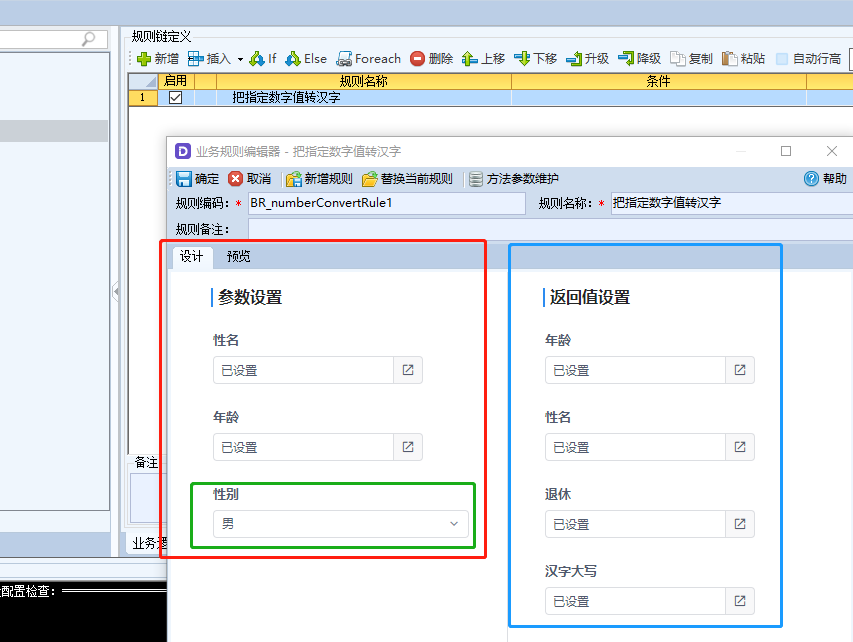
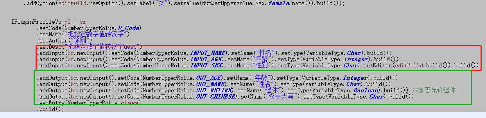
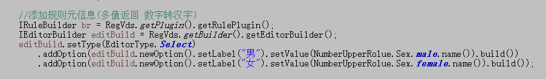
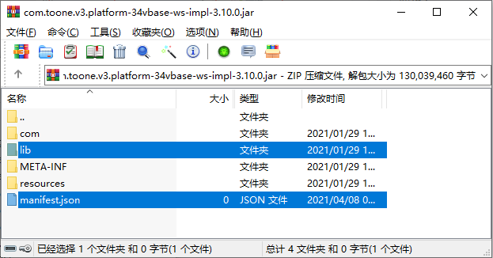
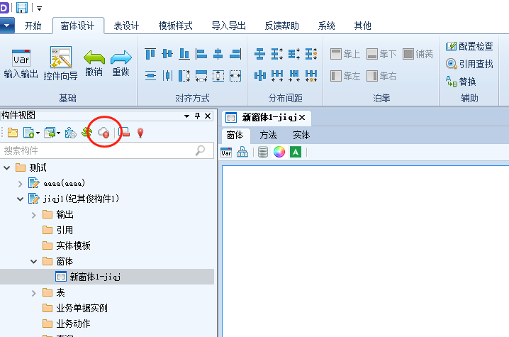
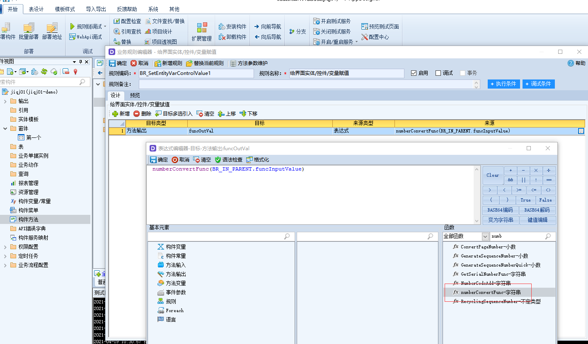

# 开发后端插件

进行开发前，请保证开发环境已经准备好，环境配置请查看**《准备环境》**一节

## **创建工程**

* 创建标准的maven工程

开发插件时，maven不是必须的，最终的成品是标准jar文件即可。

* 引用plugin-business-api，plugin-register两个构件

```markup
<?xml version="1.0" encoding="utf-8"?>
<project xmlns="http://maven.apache.org/POM/4.0.0"
	xmlns:xsi="http://www.w3.org/2001/XMLSchema-instance"
	xsi:schemaLocation="http://maven.apache.org/POM/4.0.0 http://maven.apache.org/xsd/maven-4.0.0.xsd">
	<modelVersion>4.0.0</modelVersion>
	<groupId>com.yindangu.plugin</groupId>
	<artifactId>plugin-demo</artifactId>
	<name>${project.groupId}-${project.artifactId}</name>
	<packaging>jar</packaging>
	<description>标准的maven项目</description>
	<version>0.0.1-SNAPSHOT</version>

	<properties>
 	</properties>

	<dependencies>
		<!-- ////////////////插件依赖开始/////////////////// -->
		<dependency>
  			<groupId>com.yindangu.v3.platform</groupId>
  	  	<artifactId>plugin-business-api</artifactId>
			  <version>3.3.0</version>
		</dependency>
		<dependency>
			<groupId>com.yindangu.v3.platform</groupId>
			<artifactId>plugin-register</artifactId>
			<version>3.3.0</version>
		</dependency>
		<dependency>
			<groupId>com.yindangu.v3.platform</groupId>
			<artifactId>plugin-utils</artifactId>
			<version>3.3.0</version>
		</dependency>
		<!-- ////////////////插件依赖结束//////////////////// -->
		<!-- 解析序列化Json格式数据的第三方jar包 =BEGIN -->
		<dependency>
			<groupId>com.google.code.gson</groupId>
			<artifactId>gson</artifactId>
			<version>2.8.5</version>
		</dependency>
		<!-- 解析序列化Json格式数据的第三方jar包 ==END -->

		<!-- ////////////////日志开始/////////////////// -->
		<dependency>
			<groupId>org.apache.logging.log4j</groupId>
			<artifactId>log4j-api</artifactId>
			<version>2.0</version>
		</dependency>
		<dependency>
			<groupId>org.apache.logging.log4j</groupId>
			<artifactId>log4j-core</artifactId>
			<version>2.0</version>
		</dependency>
		<dependency>
			<groupId>org.slf4j</groupId>
			<artifactId>slf4j-simple</artifactId>
			<version>1.7.0</version>
		</dependency>
		<!-- ///////////////日志结束//////////////////// -->
		<dependency>
			<groupId>junit</groupId>
			<artifactId>junit</artifactId>
			<version>4.12</version>
			<scope>test</scope>
		</dependency>

		<dependency>
			<groupId>javax.servlet</groupId>
			<artifactId>servlet-api</artifactId>
			<version>2.5</version>
			<scope>provided</scope>
		</dependency>
	</dependencies>

	<build>
		<plugins>
			<plugin>
				<groupId>org.apache.maven.plugins</groupId>
				<artifactId>maven-compiler-plugin</artifactId>
				<configuration>
					<source>1.8</source>
					<target>1.8</target>
				</configuration>
			</plugin>
			<plugin><!-- 把依赖的包导出来，方便发布构件时选择 -->
				<groupId>org.apache.maven.plugins</groupId>
				<artifactId>maven-dependency-plugin</artifactId>
				<executions>
					<execution>
						<id>copy</id>
						<phase>package</phase>
						<goals>
							<goal>copy-dependencies</goal>
						</goals>
						<configuration>
							<outputDirectory>${project.build.directory}/lib</outputDirectory>
						</configuration>
					</execution>
				</executions>
			</plugin>
		</plugins>
	</build>
</project>
```

## 插件实现样例

本样例是服务端函数插件的实现，规则插件类似

```java
package com.yindangu.plugin.demo.function;

import java.util.ArrayList;
import java.util.List;

import org.slf4j.Logger;
import org.slf4j.LoggerFactory;

import com.yindangu.plugin.demo.BusinessUtil;
import com.yindangu.v3.business.plugin.business.IResponseVo;
import com.yindangu.v3.business.plugin.business.api.func.IFuncContext;
import com.yindangu.v3.business.plugin.business.api.func.IFuncOutputVo;
import com.yindangu.v3.business.plugin.business.api.func.IFuncVObject;
import com.yindangu.v3.business.plugin.business.api.func.IFunction;

/**
 * 数字转换成汉字
 * @author jiqj
 *
 */
public class NumberUpperFunc implements IFunction{

	  public static final String D_Code="numberConvertFunc";
	
    private static final Logger log = LoggerFactory.getLogger(NumberUpperFunc.class);
    
    public NumberUpperFunc(){
        log.info("函数:数字转换成汉字");
    }

    @Override
    public IFuncOutputVo evaluate(IFuncContext context) {
        /////////////////输入参数检查///////////////////
        Number nb = (Number)context.getInput(0);
        if(nb == null){
            throw new RuntimeException("参数1--行数不能为空！");
        }
        ////////////////业务实现 api 完全与平台无关////////////////////
        String rs = BusinessUtil.toChinese(nb.intValue());
        log.info("数字（{}）转换成汉字（{}）",nb,rs);
        IFuncOutputVo vo = context.newOutputVo();
        return vo.put(rs);
    }
    

    /**
     * 本地调试代码
     * @param args
     */
    public static void main(String[] args){
        final List<Object> pars = new ArrayList<Object>();
        pars.add(92287);
        IFuncContext fc = new IFuncContext() {
            @Override  
            public int getInputSize() { 
                return pars.size();
            }
            @Override
            public Object getInput(int idx) {  
                return (idx < pars.size() ? pars.get(idx) : null);
            }
        		@Override
        		public IFuncVObject getVObject() {
        			return null;
        		}
        		@Override
        		public IFuncOutputVo newOutputVo() {
        			return null;
        		}
        };
        
        IFunction  func = new NumberUpperFunc(); 
        IResponseVo fr = func.evaluate(fc);
        log.info("函数返回:"  + fr.get());
    }
}
```

## 插件注册器使用样例

插件注册器（IRegisterPlugin）是V-DevSuite注册扩展插件的总接口，每个构件（插件jar包）只允许提供一个IRegisterPlugin的实现，用来汇聚该构件所开发的全部插件及插件的元信息。

```java
package com.yindangu.plugin.demo;

import java.util.Arrays;
import java.util.List;

import com.yindangu.plugin.demo.function.NumberUpperFunc;
import com.yindangu.v3.plugin.vds.reg.api.IRegisterPlugin;
import com.yindangu.v3.plugin.vds.reg.api.builder.IEntityBuilder;
import com.yindangu.v3.plugin.vds.reg.api.builder.IFunctionBuilder;
import com.yindangu.v3.plugin.vds.reg.api.builder.IRuleBuilder;
import com.yindangu.v3.plugin.vds.reg.api.model.IComponentProfileVo;
import com.yindangu.v3.plugin.vds.reg.api.model.IPluginProfileVo;
import com.yindangu.v3.plugin.vds.reg.api.model.VariableType;
import com.yindangu.v3.plugin.vds.reg.common.RegVds;

/**
 * 构件注册器(注册入口)
 * @author jiqj
 *
 */
public class MyRegisterPlug2 implements IRegisterPlugin {
	@Override
	public IComponentProfileVo getComponentProfile() {
		return RegVds.getPlugin().getComponetProfile().setGroupId("com.yindangu.plugin").setCode("mydemo").build();
	}

	@Override
	//	插件注册器返回插件元信息对象
	public List<IPluginProfileVo> getPluginProfile() {
		IPluginProfileVo func = getNumberUpperFunc();
		return Arrays.asList(func );
	}

	/** 函数元信息(数字转汉字) */
	private IPluginProfileVo getNumberUpperFunc() {
	
		IFunctionBuilder bf = RegVds.getPlugin().getFunctiontPlugin();
		IPluginProfileVo p1 = bf.setCode(NumberUpperFunc.D_Code).setName("数字转汉字-name").setDesc("数字转汉字").setAuthor("徐刚")
				.addInputParam(bf.newParam().setType(VariableType.Integer).setDesc("数字").build())
				.setEntry(NumberUpperFunc.class)
				.setOutput(bf.newOutput().setType(VariableType.Char).setDesc("汉字大写").build()).build();
		return p1;
	}
}
```


前面函数插件实现样例中，函数的输入参数类型是整形，函数的返回值是字符型，函数的名称、描述、作者、函数class、输入参数名称、返回值名称，都使用函数插件元信息的创建器IFunctionBuilder进行构造，最后执行build\(\)得到IPluginProfileVo对象添加到List中，返回给IRegisterPlugin的getPluginProfile即完成插件注册。

```java
@Override
//	插件注册器返回插件元信息对象
public List<IPluginProfileVo> getPluginProfile() {
	IPluginProfileVo func = getNumberUpperFunc();
	return Arrays.asList(func );
}

/** 函数元信息(数字转汉字) */
private IPluginProfileVo getNumberUpperFunc() {
	IFunctionBuilder bf = RegVds.getPlugin().getFunctiontPlugin();
	IPluginProfileVo p1 = bf.setCode(NumberUpperFunc.D_Code)
			.setName("数字转汉字-name").setDesc("数字转汉字").setAuthor("徐刚")
			.addInputParam(
						bf.newParam().setType(VariableType.Integer).setDesc("数字").build()
					)
			.setEntry(NumberUpperFunc.class)
			.setOutput(
						bf.newOutput().setType(VariableType.Char).setDesc("汉字大写").build()
					).build();
	return p1;
}
```


插件注册器实现类的getComponentProfile方法，用于收集返回插件构件本身的编码名称。这个编码名称在构件安装到执行系统（V-AppServer）的时候需要用到，用于标识该插件构件名称、编码。

```java
@Override
public IComponentProfileVo getComponentProfile() {
	return RegVds.getPlugin().getComponetProfile().setGroupId("com.yindangu.plugin").setCode("mydemo").build();
}
```

\*\*\*\*

**注意：**插件注册器的实现类的只允许编写注册插件相关的代码，不能加入业务逻辑处理的代码，否则部署插件可能会因出现依赖问题导致部署不通过。

## 规则插件元信息使用样例

规则插件元信息中的规则的输入、输出参数描述，主要是用于规则部署并安装到V-DevSuite的开发工具（V-AppDesigner）后，在进行无码开发配置中，规则链选择这个二次开发的规则插件后，规则的配置界面的输入、输出参数的展现。

比如这个例子当中，“把指定数字值转汉字”这个二次开发规则的配置界面中，规则的输入参数设置中的姓名、年龄是以表达式方式提供参数的设置，性别是以枚举值的方式进行参数的设置，规则的返回值参数设置中的年龄、姓名、退休、汉字大写是用表达式方式提供参数的设置。这些参数名称、编辑器的类型都是在二次开发规则插件的时候，在插件注册器中声明规则插件元信息进行注册的（注：参数若不指定编辑器则默认提供表达式编辑器）。



对应下面的代码描述



性别是枚举类型，需要使用下拉框



## 编译jar

使用maven命令打包标准的jar包即可。如果有使用第三方jar包，则需要把它们加入到当前jar的lib目录下。



**lib目录**:使用maven打包是不会自动生成lib目录的，如果有使用第三方jar包，需要手工创建lib目录，把它们手供加入到lib目录。建议使用maven的"maven-dependency-plugin"插件，该插件可以把当前工程依赖的第三方jar前输出到target，便于收集并的加入到jar的lib目录中。

_验证依赖第三方是否发布成功，可以参考FAQ的《引用第三方jar》节点说明_

**manifest.json：**如果打包的jar同时包含了前端的插件（允许前端、后端插件一起打包到一个jar的），就需要提供这个文件，后面前端插件开发的章节会详细描述这个文件如何编写，如果只是打包后台插件的jar包，则无需创建此文件。

## 发布到执行系统

请参考[《发布插件》](https://yindangu.gitbook.io/v-devsuite/kuo-zhan-kai-fa/vdevsuite-cha-jian-kai-fa-zhi-nan/fa-bu-cha-jian)

## 使用插件

上传部署成功后，在开发系统如图点击云更新后，就可以在V-AppDesigner的规则链配置中选择使用已部署的规则函件、函数插件了。



插件的使用

这里举例函数插件，使用方式就与平台提供的函数一样。函数名对应函数插件注册的元数据中的code属性。



执行系统（V-AppServer）插件的使用

在开发工具\(V-AppDesigner\)做本地调试（此功能正在开发中...）

插件构件jar部署后，开发工具加载相同云项目的无码开发人员，会收到项目可更新提示，手动更新项目后，插件构件会自动安装进开发工具，如果此时开发工具的测试服务已经启动（右下角第三盏绿灯亮起），插件会制动安装到测试服务，立即可以在本地测试服务进行调试和查看效果，如果测试服务未启动，则会把插件保存至测试服务预安装目录，待测试服务手动启动后，自动安装。

在独立服务器版（V-AppServer）运行

插件构件jar部署后，会自动关联到对应项目的内置清单当中（可在[VTeam](http://team.yindangu.com)项目中查看）。执行系统需要把部署到项目中的构件选入已安装的项目主清单中，并重新生成清单，迁移到执行系统上对应已安装清单的阶段，之后执行系统进行产品升级，就可以更新到该插件构件。

## 规则、函数使用说明

前面的插件实现样例讲述的是函数插件的例子，规则插件与函数插件的实现类似。

函数入参是index数组下标模式，规则的入参是key-value方式。

返回值函数只能单一返回值，规则是多值返回，返回方式也是key-value方式。

## 函数实例

这是实现把数字转换为汉字大写的函数

函数接口

```java
/**函数接口*/
public interface IFunction extends IPluginBase{
    /** 
     * 函数入口
     * @param context 上下文对象
     * @return 返回单值
     */
    public IFuncOutputVo evaluate(IFuncContext context) ;
}
```

函数需要实现IFunction接口

```java
package com.yindangu.plugin.demo.function;

import java.util.ArrayList;
import java.util.List;

import org.slf4j.Logger;
import org.slf4j.LoggerFactory;

import com.yindangu.plugin.demo.BusinessUtil;
import com.yindangu.v3.platform.plugin.business.IResponseVo;
import com.yindangu.v3.platform.plugin.business.api.func.IFuncContext;
import com.yindangu.v3.platform.plugin.business.api.func.IFuncOutputVo;
import com.yindangu.v3.platform.plugin.business.api.func.IFuncVObject;
import com.yindangu.v3.platform.plugin.business.api.func.IFunction; 

/**
 * 数字转换成汉字
 * @author jiqj
 *
 */
public class NumberUpperFunc implements IFunction{
	public static final String D_Code="numberConvertFunc";
    private static final Logger log = LoggerFactory.getLogger(NumberUpperFunc.class);
    public NumberUpperFunc(){
        log.info("函数:数字转换成汉字");
    }

    @Override
    public IFuncOutputVo evaluate(IFuncContext context) {
        /////////////////参数检查///////////////////
        Number nb = (Number)context.getInput(0);
        if(nb == null){
            throw new RuntimeException("参数1--行数不能为空！");
        }
        ////////////////业务实现 api 完全与V平台无关////////////////////
        String rs = BusinessUtil.toChinese(nb.intValue());
        log.info("数字（{}）转换成汉字（{}）",nb,rs);
        //IResponseBuilder b = VDS.getBuilder().getResponseBuilder();
        IFuncOutputVo vo = context.newOutputVo();
        return vo.put(rs);
    }    
}

```

核心代码是业务实现：

```java
////////////////业务实现 api 完全与V平台无关////////////////////
String rs = BusinessUtil.toChinese(nb.intValue());
```

插件元数据描述：1个入参，整型；1个返回值，文本类型；

```java
/** 函数元信息(数字转汉字) */
	private IPluginProfileVo getNumberUpperFunc() {
		IFunctionBuilder bf = RegVds.getPlugin().getFunctiontPlugin();
		IPluginProfileVo p1 = bf.setCode(NumberUpperFunc.D_Code).setName("数字转汉字-name").setDesc("数字转汉字").setAuthor("徐刚")
				.addInputParam(bf.newParam().setType(VariableType.Integer).setDesc("数字").build())
				.setEntry(NumberUpperFunc.class)
				.setOutput(bf.newOutput().setType(VariableType.Char).setDesc("汉字大写").build()).build();
		return p1;
	}
```

## 规则实例

这是把实体的某列的数字转换为汉字大写

规则接口

```java
/** 二次开发规则接口*/
public interface IRule extends IPluginBase{
    /**
     * 规则入口
     * @param context 上下文对象
     * @return 
     */
    public IRuleOutputVo evaluate(IRuleContext context) ;
}
```

规则需要实现IRule接口

```java
package com.yindangu.plugin.demo.rule;

import java.util.List;
import java.util.Map;

import org.slf4j.Logger;
import org.slf4j.LoggerFactory;

import com.yindangu.plugin.demo.BusinessUtil;
import com.yindangu.v3.platform.plugin.business.api.rule.IRule;
import com.yindangu.v3.platform.plugin.business.api.rule.IRuleContext;
import com.yindangu.v3.platform.plugin.business.api.rule.IRuleOutputVo;
 
/**
 * 多值返回 数字转汉字
 * @author jiqj
 *
 */
public class NumberUpperRolueEntity implements IRule{
    private static final Logger log = LoggerFactory.getLogger(NumberUpperRolueEntity.class);
    public static final String D_Code="numberConvertEntity";
    public static final String INPUT_USERLLIST="userList",INPUT_AGE="age";
    public static final String OUT_USERLLIST="userList2",OUT_COUNT="count";
    public static final String FD_AGE="age",FD_NAME="name",FD_CHINESE="chinese";
 
    @SuppressWarnings({ "unused", "unchecked", "rawtypes" })
	public IRuleOutputVo evaluate(IRuleContext context) {
    	String field = (String)context.getInput(FD_AGE);
    	List<Map> entity = (List<Map>)context.getInput(INPUT_USERLLIST);
    	//IDataView dv = (IDataView)context.getVObject().getInput(INPUT_USERLLIST);//取v原对象
    	
    	int count = 0;
    	for(Map m : entity) {
    		String name = (String)m.get(FD_NAME);
    		Integer age = (Integer)m.get(FD_AGE);
    		String chinese  = BusinessUtil.toChinese(age.intValue());
    		m.put(FD_CHINESE,chinese );
    		count++;
    	}

    	IRuleOutputVo vo = context.newOutputVo(); //VDS.getBuilder().getResponseBuilder();
        return vo.put(OUT_USERLLIST, entity)
        		.put(OUT_COUNT, count) ;
    }

}

```

插件元数据描述：

2个入参:a）用户列表，实体；b\)转换的列，字符型

2个返回值:a）列表，实体；b\)转换记录数，整型

```java
/** 添加规则元信息(把指定列 数字转汉字) */
	private IPluginProfileVo getNumberUpperRolueEntity() {

		IRuleBuilder br = RegVds.getPlugin().getRulePlugin();
		// 添加规则元信息(把指定列 数字转汉字)
		IRuleBuilder br2 = RegVds.getPlugin().getRulePlugin();
		IEntityBuilder entryBuild = RegVds.getBuilder().getEntityProfileBuilder();
		IRuleBuilder.IRuleInputBuilder ruleInputEntry = br.newInput().setCode(NumberUpperRolueEntity.INPUT_USERLLIST)
				.setName("用户列表").setType(VariableType.Entity)
				.addField(entryBuild.newField().setCode("age").setName("年龄").setType(VariableType.Integer).build())
				.addField(entryBuild.newField().setCode("name").setName("性名").setType(VariableType.Char).build())
				.addField(entryBuild.newField().setCode(NumberUpperRolueEntity.FD_CHINESE).setName("汉字大写")
						.setType(VariableType.Char).build());

		IRuleBuilder.IRuleOutputBuilder ruleOutputEntry = br.newOutput().setCode(NumberUpperRolueEntity.OUT_USERLLIST)
				.setName("用户列表实体").setType(VariableType.Entity)
				.addField(entryBuild.newField().setCode(NumberUpperRolueEntity.FD_AGE).setName("年龄")
						.setType(VariableType.Integer).build())
				.addField(entryBuild.newField().setCode(NumberUpperRolueEntity.FD_NAME).setName("性名")
						.setType(VariableType.Char).build())
				.addField(entryBuild.newField().setCode(NumberUpperRolueEntity.FD_CHINESE).setName("汉字大写")
						.setType(VariableType.Char).build());

		IPluginProfileVo p4 = br2.setCode(NumberUpperRolueEntity.D_Code).setName("把指定列 数字转汉字-entity")
				.setDesc("把指定列 数字转汉字-实体").setAuthor("徐刚").addInput(ruleInputEntry.build())
				.addInput(br.newInput().setCode(NumberUpperRolueEntity.INPUT_AGE).setName("转换列名")
						.setType(VariableType.Char).build())
				.addOutput(ruleOutputEntry.build()).addOutput(br.newOutput().setCode(NumberUpperRolueEntity.OUT_COUNT)
						.setName("转换个数").setType(VariableType.Integer).build())
				.setEntry(NumberUpperRolueEntity.class).build();

		return p4;
	}
```

## HttpCommand实例

接收web请求处理扩展，需实现IHttpCommand接口

```java
/**
 * 处理页面http请求（对应com.toone的 HttpCommandBase）
 * 
 * @author jiqj
 *
 */
public interface IHttpCommand extends IPluginBase {
	public IHttpResultVo execute(IHttpContext context);
}
```

command需要实现IHttpCommand接口

```java
package com.yindangu.plugin.demo.command;
 
import com.yindangu.v3.platform.plugin.business.api.httpcommand.FormatType;
import com.yindangu.v3.platform.plugin.business.api.httpcommand.IHttpCommand;
import com.yindangu.v3.platform.plugin.business.api.httpcommand.IHttpContext;
import com.yindangu.v3.platform.plugin.business.api.httpcommand.IHttpResultVo;

public class MyHttpCommand implements IHttpCommand{

	@Override
	public IHttpResultVo execute(IHttpContext context) {
		IHttpResultVo vo = context.newResultVo();
		String name = context.getRequest().getParameter("mynamne");
		vo.setValueType(FormatType.Json)
			.setValue("{\"name\":\"数字转汉字-" + name + "\",\"entry\":\"com.yindangu.plugin.demo.function.NumberUpperFunc\",\"code\":\"numberConvertFunc\",\"desc\":\"数字转汉字\",\"output\":{\"type\":\"Char\",\"desc\":\"汉字大写\"},\"inputs\":[{\"default\":null,\"type\":\"Integer\",\"desc\":\"数字\",\"required\":true}]}")
			//.newDownload()
			;
		return vo;
	}

}
```

**插件元数据描述：**

```java
private IPluginProfileVo getHttpCommand() {
		IHttpCommandBuilder cb = RegVds.getPlugin().getHttpCommandPlugin();
		IPluginProfileVo p3 = cb.setCode("mycmd").setName("我的扩展处理").setAuthor("徐刚").setEntry(MyHttpCommand.class)
				.build();
		return p3;
	}
```

**直接http访问**

```java
operation: 插件编码(IPluginProfileVo.code)
groupId:公司id(IComponentProfileVo.groupId)
bundleCode:构件编码(IComponentProfileVo.code)

完整的URL例子：
http://10.1.28.190:8899/module-operation!executeOperation?operation=mycmd&groupId=com.yindangu.plugin&bundleCode=mydemo
```

## demo实例代码

下载[demo代码](http://download.yindangu.com/yindangu-plugin/plugin-demo/20210430/94plugin-demo-service.zip)

_\(注：若点击无法下载，请右键选择“链接另存为”进行下载\)_

另外在Git还有一份是平台开发时的调试例子，目的:

1\)API使用参考，2\)API例子覆盖面全，3\)API交流样本，更新时效。地址：

git@github.com:opensource-vplatform/vplatform-plugin-example.git

