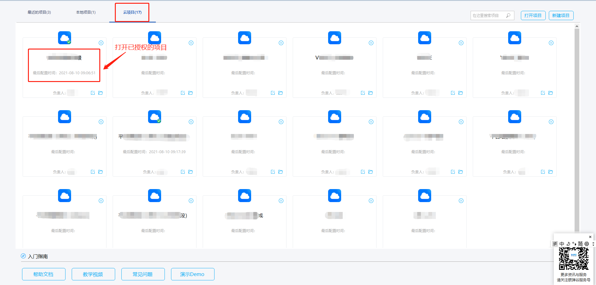

# 源码公开\(V配置窗体\)

## 说明

    V配置窗体的源码开源，是指V-DevSuite产品套装中的V-AppBase的窗体类构件进行V配置源码（无码开发平台的配置源码）的公开。目的是为了能够让外部使用者更高效的对V-DevSuite中的V-AppBase平台基础服务进行定制开发。平台基础服务，熟悉V平台开发的开发者应该了解，通常称作VBASE。VBASE包括一些业务基础服务功能，如组织机构、流程、权限、定时任务、菜单、门户、等。

    本章阐述的V配置窗体的源码开源，实际上是指对V-AppBase产品中展现相关的构件进行开源，同时包含窗体中使用到的私有客户端方法、服务端方法一并进行开源。其余的服务端、客户端构件方法API已拆分至其余的应用服务接口类构件中，并不进行开源。

## 开源协议

基于LGPL（GNU Lesser General Public License）

## 源码获取方式及替代方式

### 前提

1. V-AppDesigner，V-AppServer均要使用安装工具V-Box打包的2021年8月29日之后的版本环境，或已有的使用V-Box打包出的V-AppDesigner、V-AppServer环境均要升级至平台的2021年8月29日的版本
2. 使用旧打包工具（非www.yindangu.com中下载的V-Box安装程序），无法使用源码订阅查看功能
3. V-AppServer需要使用云项目开发模式，否则无法使用源码订阅查看功能

### 场景举例

#### 模拟场景需求

项目上需要“组织机构”构件下的“人员选择（多选）”窗体可以根据人员是否离职进行数据过滤， 此时可以提取V-AppBase开源窗体构件“vbase\_organization\_facade”并对”org\_user\_choosese“窗体进行定制化。

#### 操作步骤

1.提取V-AppBase开源窗体构件

登录应用设计器V-AppDesigner，切换到云项目，找到已有权限项目进行打开（注：目前V-AppBase的窗体类构件对所有云项目公开，无需额外授权）

2.在页签“订阅代码视图”中找到源码所在企业

 在订阅代码视图中，先选择代码所在的企业，点击刷新，即可看到被授权的构件清单中的业务构件。“订阅代码视图”支持直接查看代码。

右键订阅构件，可以将构件另存为本地文件。找到“vbase\_organization\_facade”构件右键“另存为”。

3.定制窗体

将V-AppBase的开源构件另存为本地文件后，可在构件视图中对构件窗体进行定制化，找到“人员选择（多选）”窗体，新增一个布尔框用于过滤是否离职的人员。

实现对应的值改变事件

4.部署构件到vstore云仓库

将定制好的构件部署到vstore云仓库中

注意所有V-AppBase的窗体定制，目前的粒度是到构件级别，即不管定制了这个构件里面一个还是多个窗体，也需要以构件的粒度进行部署和后续的替代

5.VTeam设置优先级

5.1登录到vteam找到所在项目，将刚部署好的构件添加到清单中

5.2设置优先级，以自己定制的构件优先生效

点击生成清单，界面会弹出一个设置优先级排序的窗体，设置优先级

6.安装项目清单，查看效果

服务安装好清单，（或原先已经安装好进行产品升级后），打开窗体即可看到效果

