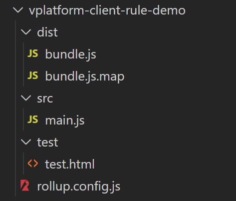
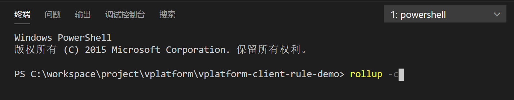

# 客户端规则/函数插件开发

## 创建插件项目

V平台的插件体系支持业界开放性的技术开发规范，做到最大的包容性。

这里以**JavaScript 官方模块化标准的 ES6规范**来进行样例工程开发说明（如果希望使用其它的业界常用模块化开发标准，如CommonJS 和 AMD等，V平台仍然可支持适配）。

另外，这里建议使用[Rollup](https://www.rollupjs.com/)作为JavaScript 模块打包器（当然，也可自选其它方式，如[Webpack](https://webpack.js.org/)）。



在工程的src文件夹下添加main.js文件：

```javascript
//客户端规则的默认入口方法名为evaluate; ruleContext为规则入参,参数格式为json对象
var evaluate = function (ruleContext) {
    console.log("hello vplatform!");
    alert(ruleContext.prop1 + " " + ruleContext.prop2 + "!");
};

export {
    evaluate
}
```

在工程的根目录下添加打包配置文件[rollup.config.js](https://www.rollupjs.com/guide/command-line-reference/#%E9%85%8D%E7%BD%AE%E6%96%87%E4%BB%B6configuration-files)

```javascript
// rollup.config.js
export default {
  input: 'src/main.js',//源码主入口路径
  output: {
    file: 'dist/bundle.js',//打包输出路径
    format:'umd',//编译出umd格式
    name:'com.yindangu.rule.demo',//定义全局命名空间
    sourcemap:true
  }
  
};
```

## 制品bundle要求


V平台对原生技术输出的制品有两个要求：

1. 为了能最大程度适配到各种运行环境，这里唯一的要求是需要输出为[umd](https://zhuanlan.zhihu.com/p/79695530)类型。
2. 输出的制品需要有全局命名空间。


####  **通过 format 属性Rollup可以设置你想要打包成的格式类型：**

* amd - 输出成AMD模块规则，RequireJS可以用
* cjs - CommonJS规则，适合Node，Browserify，Webpack 等 es - 默认值，不改变代码 
* iife - 输出自执行函数，最适合导入html中的script标签，且代码更小
* **umd** - 通用模式，amd, cjs, iife都能用

#### **通过name属性Rollup可以很方便的设置输出制品的全局命名空间：**

例如本样例中把全局命名空间设置为“com.yindangu.rule.demo”。

## 编译打包

接下来，只需要在工程根目录下执行命令rollup -c，即可打包输出dist/bundle.js到指定目录中。



## 本地测试

可增加本地测试页面test/test.html，用于调试验证。

```markup
<html>

<script src="../dist/bundle.js">
</script>
<!--需要的情况下，可自主通过银弹谷cdn云服务引入依赖的JavaScript公共库;
    (如果通过ES模块引用方式，则按照以下npm包规范引入"@提供商/库名",如"@yindangu/vplatform-plugin")
<script src="http://cdn.yindangu.com/libs/yindangu/vplatform-plugin.min.js"></script>
-->
<script>
    var ruleContext = {
        "prop1": "hello",
        "prop2": "vplatform"
    }
    window.com.yindangu.rule.demo.evaluate(ruleContext);
</script>

</html>
```

  


 


