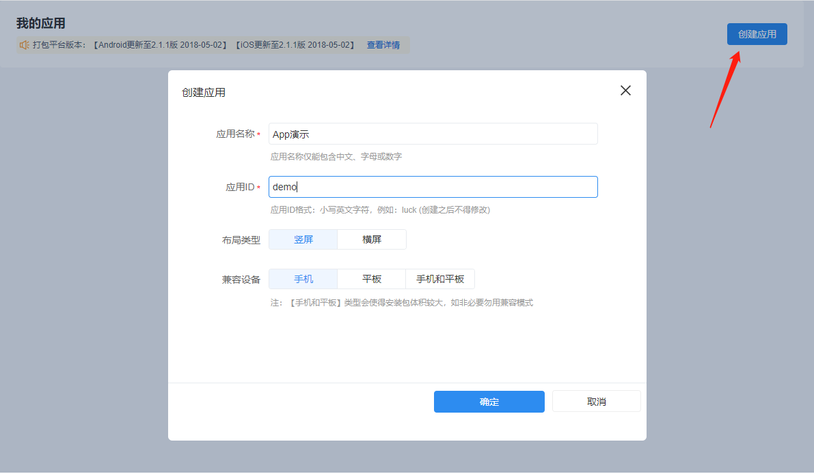
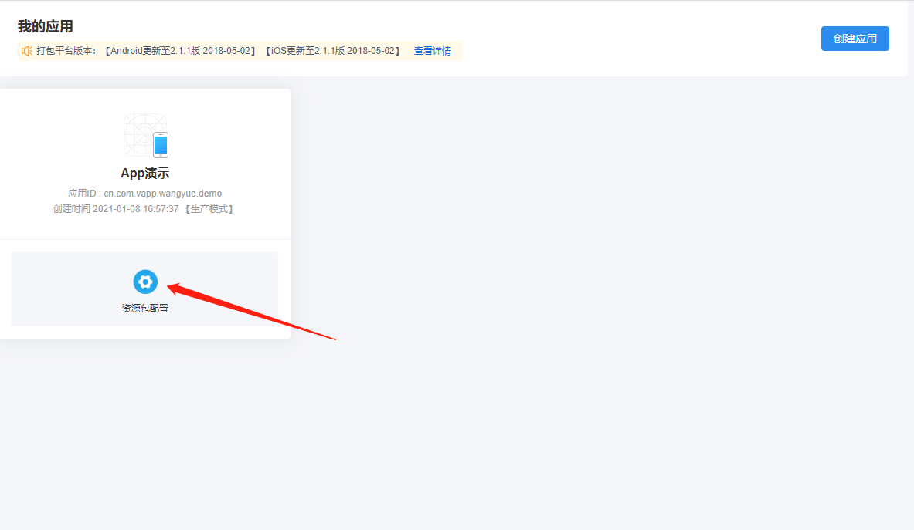
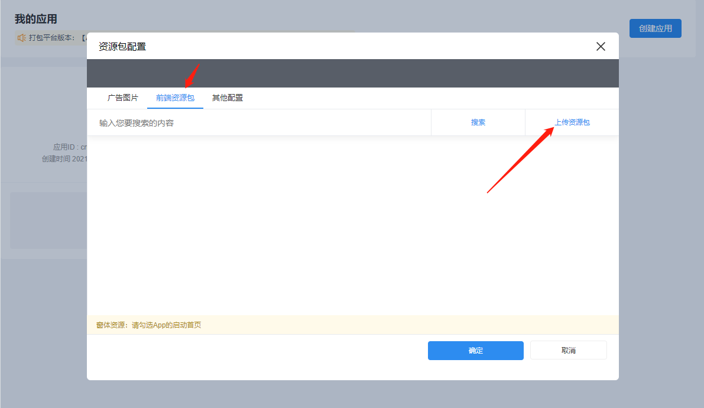
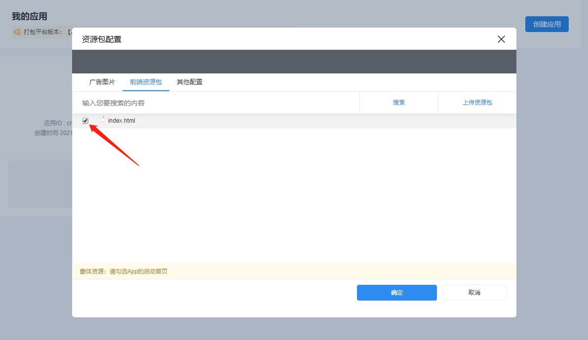
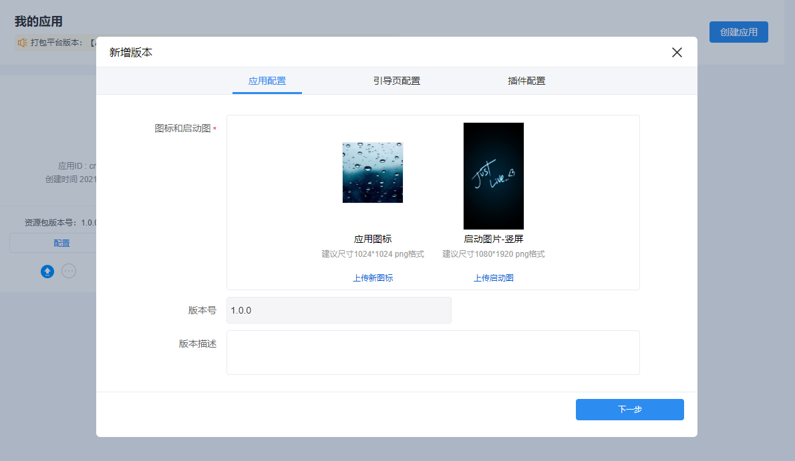
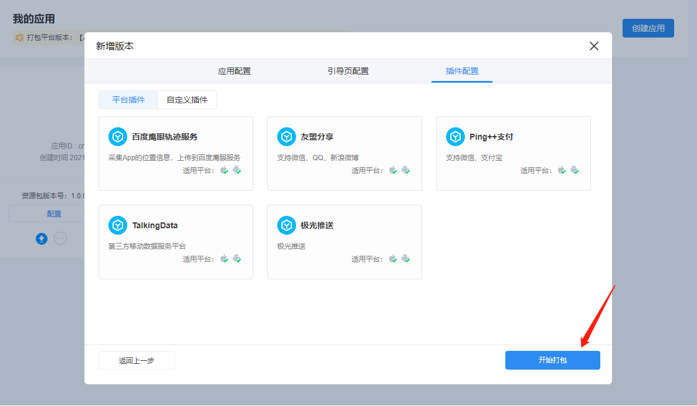

# Hybrid App云打包


#### Hybrid App云打包服务是基于[Cordova](http://cordova.apache.org/)框架搭建而成，支持用户上传自定义前端资源包，搭配[V-DevSuite JS SDK](https://yindangu.gitbook.io/v-devsuite/)可实现调用V平台与原生功能相关的规则（目前仅支持移动设备硬件操作、获取当前App版本号规则，其他规则陆续支持），同时，该打包服务提供补丁包升级、版本升级通知、上传自定义Cordova插件等功能。


## App云打包使用步骤

#### 步骤1：登录软云

注册并登录软云（[http://cloud.yindangu.com](http://cloud.yindangu.com)），进入企业 - 软云控制台 - 企业信息（右上角    ） -  扩展开发云服务 - Hybrid App 云打包

#### 步骤2：创建App

#### 步骤3：配置资源包

这里给出一个最简单的[前端资源包样例](https://qiniu.yindangu.net/vds/demo/demo.zip)，一个html页面通过引用vds来调用V服务的【移动设备硬件操作】规则，来打开App的闪光灯。**（vds的详细使用方法可参考**[V-DevSuite JS SDK](https://yindangu.gitbook.io/v-devsuite/)**）。**

#### 步骤3：新增版本，打包App

#### 步骤4：下载安装App

App打包完成后，点击下载按钮，扫描二维码安装App

