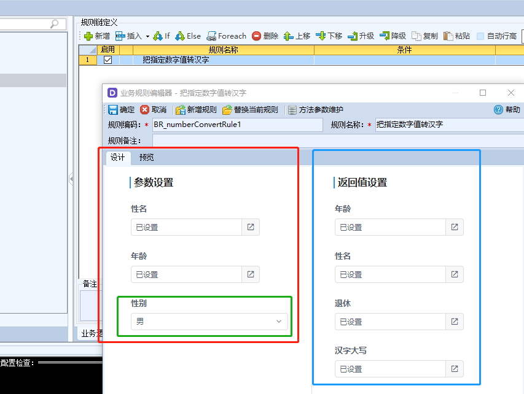
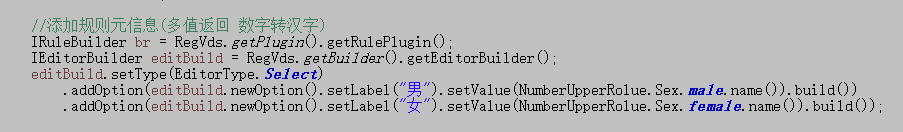

# 开发后端插件

## **前提要求**

* **需实现平台提供的扩展接口**

例如：如果要实现函数扩展，那么就要实现IFunction接口。 要实现规则扩展，就要实现IRule接口。 要实现HttpCommand扩展，就要实现IHttpCommand接口。 以后平台逐步开放一些标准接口处理

* **plugin-business-api模块\(必须\)**

基础模块。平台开发的接口都放在这个模块，所以必须引用。引用有2种方式，第一种是通过maven引用；第二种是直接通过官网下载这个jar文件

* **plugin-register模块\(推荐\)**

它的功能作用是：构造接口元素描述服务。我们提供的build工具，轻量级的实现，构建插件描述信息

* **plugin-utils模块\(可选\)**

功能作用是一些标准的工具，例如Json,xml,加密、解密等业界标准工具。方便二次开发的工具

## **创建工程**

* 创建标准的maven工程

开发插件时，maven不是必须的，最终的成品是标准jar文件就可以了。

* 引用plugin-business-api，plugin-register两个构件

```markup
<?xml version="1.0" encoding="utf-8"?>
<project xmlns="http://maven.apache.org/POM/4.0.0"
	xmlns:xsi="http://www.w3.org/2001/XMLSchema-instance"
	xsi:schemaLocation="http://maven.apache.org/POM/4.0.0 http://maven.apache.org/xsd/maven-4.0.0.xsd">
	<modelVersion>4.0.0</modelVersion>
	<groupId>com.yindangu.plugin</groupId>
	<artifactId>plugin-demo</artifactId>
	<name>${project.groupId}-${project.artifactId}</name>
	<packaging>jar</packaging>
	<description>标准的maven项目</description>
	<version>0.0.1-SNAPSHOT</version>

	<properties>
 	</properties>

	<dependencies>
		<!-- ////////////////插件依赖开始/////////////////// -->
		<dependency>
  			<groupId>com.yindangu.v3.platform</groupId>
  	  	<artifactId>plugin-business-api</artifactId>
			  <version>3.3.0</version>
		</dependency>
		<dependency>
			<groupId>com.yindangu.v3.platform</groupId>
			<artifactId>plugin-register</artifactId>
			<version>3.3.0</version>
		</dependency>
		<dependency>
			<groupId>com.yindangu.v3.platform</groupId>
			<artifactId>plugin-utils</artifactId>
			<version>3.3.0</version>
		</dependency>
		<!-- ////////////////插件依赖结束//////////////////// -->
		<!-- 解析序列化Json格式数据的第三方jar包 =BEGIN -->
		<dependency>
			<groupId>com.google.code.gson</groupId>
			<artifactId>gson</artifactId>
			<version>2.8.5</version>
		</dependency>
		<!-- 解析序列化Json格式数据的第三方jar包 ==END -->

		<!-- ////////////////日志开始/////////////////// -->
		<dependency>
			<groupId>org.apache.logging.log4j</groupId>
			<artifactId>log4j-api</artifactId>
			<version>2.0</version>
		</dependency>
		<dependency>
			<groupId>org.apache.logging.log4j</groupId>
			<artifactId>log4j-core</artifactId>
			<version>2.0</version>
		</dependency>
		<dependency>
			<groupId>org.slf4j</groupId>
			<artifactId>slf4j-simple</artifactId>
			<version>1.7.0</version>
		</dependency>
		<!-- ///////////////日志结束//////////////////// -->
		<dependency>
			<groupId>junit</groupId>
			<artifactId>junit</artifactId>
			<version>4.12</version>
			<scope>test</scope>
		</dependency>

		<dependency>
			<groupId>javax.servlet</groupId>
			<artifactId>servlet-api</artifactId>
			<version>2.5</version>
			<scope>provided</scope>
		</dependency>
	</dependencies>

	<build>
		<plugins>
			<plugin>
				<groupId>org.apache.maven.plugins</groupId>
				<artifactId>maven-compiler-plugin</artifactId>
				<configuration>
					<source>1.6</source>
					<target>1.6</target>
				</configuration>
			</plugin>
			<plugin><!-- 把依赖的包导出来，方便发布构件时选择 -->
				<groupId>org.apache.maven.plugins</groupId>
				<artifactId>maven-dependency-plugin</artifactId>
				<executions>
					<execution>
						<id>copy</id>
						<phase>package</phase>
						<goals>
							<goal>copy-dependencies</goal>
						</goals>
						<configuration>
							<outputDirectory>${project.build.directory}/lib</outputDirectory>
						</configuration>
					</execution>
				</executions>
			</plugin>
		</plugins>
	</build>
</project>
```

## 编写实现

例子是函数的实现，对规则也是类似

```java
package com.yindangu.plugin.demo.function;

import java.util.ArrayList;
import java.util.List;

import org.slf4j.Logger;
import org.slf4j.LoggerFactory;

import com.yindangu.plugin.demo.BusinessUtil;
import com.yindangu.v3.platform.plugin.business.IResponseVo;
import com.yindangu.v3.platform.plugin.business.api.func.IFuncContext;
import com.yindangu.v3.platform.plugin.business.api.func.IFuncOutputVo;
import com.yindangu.v3.platform.plugin.business.api.func.IFuncVObject;
import com.yindangu.v3.platform.plugin.business.api.func.IFunction; 

/**
 * 数字转换成汉字
 * @author jiqj
 *
 */
public class NumberUpperFunc implements IFunction{
	public static final String D_Code="numberConvertFunc";
    private static final Logger log = LoggerFactory.getLogger(NumberUpperFunc.class);
    public NumberUpperFunc(){
        log.info("函数:数字转换成汉字");
    }

    @Override
    public IFuncOutputVo evaluate(IFuncContext context) {
        /////////////////参数检查///////////////////
        Number nb = (Number)context.getInput(0);
        if(nb == null){
            throw new RuntimeException("参数1--行数不能为空！");
        }
        ////////////////业务实现 api 完全与V平台无关////////////////////
        String rs = BusinessUtil.toChinese(nb.intValue());
        log.info("数字（{}）转换成汉字（{}）",nb,rs);
        //IResponseBuilder b = VDS.getBuilder().getResponseBuilder();
        IFuncOutputVo vo = context.newOutputVo();
        return vo.put(rs);
    }
    

    /**
     * 单机调试代码
     * @param args
     */
    public static void main(String[] args){
        final List<Object> pars = new ArrayList<Object>();
        pars.add(92287);
        IFuncContext fc = new IFuncContext() {
            @Override  
            public int getInputSize() { 
                return pars.size();
            }
            @Override
            public Object getInput(int idx) {  
                return (idx < pars.size() ? pars.get(idx) : null);
            }
			@Override
			public IFuncVObject getVObject() {
				// TODO Auto-generated method stub
				return null;
			}
			@Override
			public IFuncOutputVo newOutputVo() {
				// TODO Auto-generated method stub
				return null;
			}
        };
        
        IFunction  func = new NumberUpperFunc(); 
        IResponseVo fr = func.evaluate(fc);
        log.info("函数返回:"  + fr.get());
    }
}
```

## 构件注册器

构件注册器的作用是说明构件的作用等信息。一个构件可以注册多个插件，例如可以把函数、规则、前端的规则、函数都可以放在一个构件里。

**最重要的作用**是定义插件的入参、出参：

a\)在开发系统可以定义参数编辑框。

b\)在V平台调用是可以做参数转换及传递。上面的例子就有1个整型的入参，1个字符串的返回值\(函数只有1个返回值，规则可以多个\)

注册器需实现IRegisterPlugin接口，对插件信息描述

**注意：**注册器的类必须就只有注册效果的代码，不要把业务处理的代码也加到注册器的类里。

```java
package com.yindangu.plugin.demo;

import java.util.Arrays;
import java.util.List;

import com.yindangu.plugin.demo.function.NumberUpperFunc;
import com.yindangu.v3.platform.plugin.reg.api.base.IRegisterPlugin;
import com.yindangu.v3.platform.plugin.reg.api.model.IComponentProfileVo;
import com.yindangu.v3.platform.plugin.reg.api.model.IPluginProfileVo;
import com.yindangu.v3.platform.plugin.reg.api.model.VariableType;
import com.yindangu.v3.platform.plugin.vds.reg.api.builder.IFunctionBuilder;
import com.yindangu.v3.platform.plugin.vds.reg.common.RegVds;

/**
 * 构件注册器(注册入口)
 * @author jiqj
 *
 */
public class MyRegisterPlug2 implements IRegisterPlugin {
	@Override
	public IComponentProfileVo getComponentProfile() {
		return RegVds.getPlugin().getComponetProfile().setGroupId("com.yindangu.plugin").setCode("mydemo").build();
	}

	@Override
	public List<IPluginProfileVo> getPluginProfile() {
		IPluginProfileVo func = getNumberUpperFunc();
		return Arrays.asList(func );
	}

	/** 函数元信息(数字转汉字) */
	private IPluginProfileVo getNumberUpperFunc() {
		IFunctionBuilder bf = RegVds.getPlugin().getFunctiontPlugin();
		IPluginProfileVo p1 = bf.setCode(NumberUpperFunc.D_Code).setName("数字转汉字-name").setDesc("数字转汉字").setAuthor("徐刚")
				.addInputParam(bf.newParam().setType(VariableType.Integer).setDesc("数字").build())
				.setEntry(NumberUpperFunc.class)
				.setOutput(bf.newOutput().setType(VariableType.Char).setDesc("汉字大写").build()).build();
		return p1;
	}
}
```

## 插件元数据说明

元数据信息将决定开发系统的入参、出参定义界面 例如下面的规则有3个入参，4个出参。在元数据定义时可以定义入参的类型、编辑入参时使用什么样的编辑器。



对应下面的代码描述


性别是枚举类型，需要使用下拉框



## 编译jar

使用maven命令打包标准的jar即可。如果有使用第3方jar，就把它们加入到jar的lib目录


**lib目录**:maven打包后是没有的，如果有使用第3方jar，需要手工创建lib,把它们加入到jar的lib目录。maven的"maven-dependency-plugin"插件可以把当前工程依赖的jar以前输出到target，可以很方便的加入到jar中。

**manifest.json：**如果包含了前端的插件，就需要这个文件。否则jar增强后，V平台自动创建。

## 发布插件

制作jar后，就要上传V平台进行注册、增强


返回每个插件的状态,只要有一个不成功，就整个构件发布不成功\(现在的截图是不成功的，如果是成功返回“成功”文字\)


