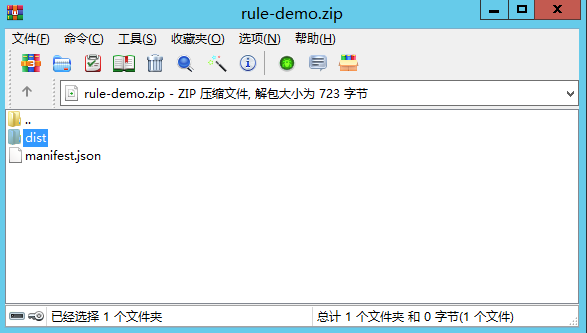

# 开发前端插件

## **前提要求**

1. 要模块化开发。
2. 需要有入口方法
3. 导入平台提供的功能引入方式 vds.import\("vds.ds.\*"\)，其中“vds.import”不能重定义;
4. 需要手写接口描述json文件（后端是使用builder模式）

## **环境准备**

V平台的插件体系支持业界开放性的技术开发规范，做到最大的包容性。这里以JavaScript 官方模块化标准的 ES6规范来进行样例工程开发说明（如果希望使用其它的业界常用模块化开发标准，如CommonJS 和 AMD等，V平台仍然可支持适配）。

另外，这里建议使用[rollup](https://www.rollupjs.com/)作为JavaScript 模块打包器（当然，也可自选其它方式，如[webpack](https://webpack.js.org/)）,下面安装rollup开发过程为例子进行说明

_rollup不是必须的，但是没有它工作效率比较低。_

* 安装node [node.js 安装详细步骤教程](https://blog.csdn.net/antma/article/details/86104068)

只有第一步骤，第二步骤是必须的。其他步骤是高级配置，可以忽略。验证安装是否成功

```bash
node -v
npm -v
```

安装成功后可以设置一下淘宝镜像\(提高安装速度\)

```bash
npm config set registry https://registry.npm.taobao.org
```

* 安装rollup

```bash
npm install rollup -g
```

验证是否安装成功

```bash
npm rollup -v
```

* **rollup配置**

rollup.config.js

```javascript
import babel from "rollup-plugin-babel";
import { terser } from 'rollup-plugin-terser';
// rollup.config.js
export default {
  input: 'src/main.js',//源码主入口路径
  output: {
    file: 'dist/define.js',//打包输出路径
    format:'umd',//编译出umd格式
    name:'com.yindangu.rule.demo',//定义全局命名空间
    sourcemap:true
  },
  plugins: [
    babel({ runtimeHelpers: true }),//babel转换
    terser()//脚本压缩
  ]
};
```

package.json

```javascript
{
  "name": "vplatform-client-rule-demo",
  "version": "1.0.0",
  "description": "客户端规则插件样例",
  "main": "./src/main.js",
  "directories": {
    "test": "test"
  },
  "dependencies": {},
  "devDependencies": {
    "@babel/core": "^7.12.9",
    "@babel/plugin-transform-runtime": "^7.12.1",
    "@babel/preset-env": "^7.12.7",
    "babel-preset-es2015-rollup": "^3.0.0",
    "rollup": "^2.34.1",
    "rollup-plugin-babel": "^4.4.0",
    "rollup-plugin-terser": "^7.0.2"
  },
  "scripts": {
    "test": "echo \"Error: no test specified\" && exit 1"
  },
  "keywords": [
    "v3"
  ],
  "author": "yindangu",
  "license": "ISC"
}

```

把这两个配置文件rollup.config.js、package.json放在项目根目录。编译环境就准备好了

## **编写业务代码**

根据package.json 配置，业务代码在 src/main.js为主文件

```javascript
/*
 * 删除指定实体的记录，删除选中行的记录
 * 规则编号：DeleteListSelectRow
 * 规则配置信息:
 * 1、entityCode 实体编号
 */
vds.import("vds.ds.*"); //引用了vds工具包的ds模块
let evaluate = function (ruleContext) {
    return new Promise((resolve,reject)=>{
		//获取实体编号配置
		let entity = ruleContext.getInput("entityCode");
		if(!entity){
			reject(Error("未找到实体,请检查实体编号配置!"));
		}else{
			//获取实体实例
			let resultSet = entity.getSelectedRecords();
			let ids = [];
			resultSet.iterate(function(record){
				ids.push(record.getSysId());
			});
			entity.deleteRecordByIds(ids);
		}
		resolve();
	});
};

export {
    evaluate
}
```

## **编译生成define.js**

```javascript
npm install
rollup -c rollup.config.js
```

编译后的目标文件在dist/bundle.js，如果不使用rollup，就手工编写define.js文件（标准的js文件）

## **编写元数据文件**

前端需要手写manifest.json文件

```javascript
{
  "groupId":"com.yindangu.vplatform.client.rule",
  "code":"DeleteListSelectRow",
  "plugins":[{
    "type":"rule",
    "scope":"client",
    "code":"DeleteListSelectRow",
    "name":"删除实体中选中记录",
    "desc":"删除指定实体的记录，删除选中行的记录",
    "entry":"com.yindangu.rule.demo.evaluate",
    "defineUrl":"./dist/define.js",//目标文件（必须）
    "debugUrl":"", //测试文件（可选）
    "inputs":[{
      "property":{
        "code":"entityCode",
        "name":"实体编号",
        "desc":"选择实体"
      },
      "editor":{
        "type":"entity",
        "required":true
      }
    }]
  }]
}
```

## **打包文件格式**

zip格式，必须文件define.js,manifest.json



根据manifest.json的defineUrl配置， 文件define.js在dist目录

## **发布构件**

在开发系统上传，过程与后端相同

## **使用构件**

在开发系统上传，过程与后端相同

