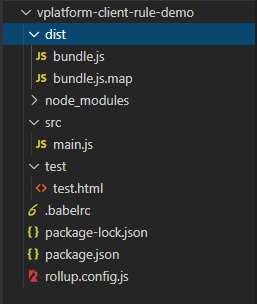

# V平台客户端规则/函数插件开发

## 创建插件项目

V平台的插件体系支持业界开放性的技术开发规范，做到最大的包容性。

这里以**JavaScript 官方模块化标准的 ES6规范**来进行样例工程开发说明（如果希望使用其它的业界常用模块化开发标准，如CommonJS 和 AMD等，V平台仍然可支持适配）。

另外，这里建议使用[Rollup](https://www.rollupjs.com/)作为JavaScript 模块打包器（当然，也可自选其它方式，如[Webpack](https://webpack.js.org/)）。



在工程的src文件夹下添加main.js文件：

```javascript
/*
 * 需求：将数值转换成中文
 * 客户端规则的默认入口方法名为evaluate; params为规则入参,参数格式为json对象
 */
let cnNum = ['零', '一', '二', '三', '四', '五', '六', '七', '八', '九'];
let numToCN = function(num){
	 let numStr = num+"";
	 let result = [];
	 for(let i=0,len=numStr.length;i<len;i++){
		 let index = parseInt(numStr.charAt(i));
		result.push(cnNum[index]);
	 }
	 return result.join('');
 }
let evaluate = function (params) {
    return new Promise((resolve,reject)=>{
		let input = params.input;
		let num = parseInt(input);
		if(isNaN(num)){
			reject(Error("请输入整数！"));
		}else if(num<0){
			reject(Error("请输入大于零的整数！"));
		}else{
			resolve({
				out : numToCN(num)
			});
		}
    });
};

export {
    evaluate
}
```

在工程的根目录下添加打包配置文件[rollup.config.js](https://www.rollupjs.com/guide/command-line-reference/#%E9%85%8D%E7%BD%AE%E6%96%87%E4%BB%B6configuration-files)

```javascript
import babel from "rollup-plugin-babel";
import { terser } from 'rollup-plugin-terser';
// rollup.config.js
export default {
  input: 'src/main.js',//源码主入口路径
  output: {
    file: 'dist/bundle.js',//打包输出路径
    format:'umd',//编译出umd格式
    name:'com.yindangu.rule.demo',//定义全局命名空间
    sourcemap:true
  },
  plugins: [
    babel({ runtimeHelpers: true }),//babel转换
    terser()//脚本压缩
  ]
};
```

## 打包配置


V平台对原生技术输出的制品有两个规范要求：

1. 需要有规则/函数的入口方法定义，默认约定按evaluate作为方法名。
2. 打包输出为[UMD](https://zhuanlan.zhihu.com/p/79695530)类型（能最大程度适配到各种运行环境），且能通过全局命名空间来访问入口方法。


####  **通过 format 属性，Rollup可以设置你想要打包成的格式类型：**

* amd - 输出成AMD模块规则，RequireJS可以用。
* cjs - CommonJS规则，适合Node，Browserify，Webpack 等 es - 默认值，不改变代码。 
* iife - 输出自执行函数，最适合导入html中的script标签，且代码更小。
* **umd** - 通用模式，amd, cjs, iife都能用。

#### **通过name属性，Rollup可以设置输出制品的全局命名空间：**

例如本样例中把全局命名空间设置为“com.yindangu.rule.demo”。

## 输出制品

接下来，只需要在工程根目录下执行命令rollup -c，即可打包输出dist/bundle.js到指定目录中。


## 本地测试

可增加本地测试页面test/test.html，用于调试验证。

```markup
<html>

<script src="../dist/bundle.js">
</script>
<!--通过银弹谷cdn云服务引入依赖的JavaScript公共库;
    如果通过ES模块引用则按照以下规范"@提供商/库名",如"@yindangu/vplatform-plugin"
<script src="http://cdn.yindangu.com/libs/yindangu/vplatform-plugin.min.js"></script>
-->
<script>
    var params = {
        "input": "190"
    }
    var promise = window.com.yindangu.rule.demo.evaluate(params);
    promise.then(function(result){
        alert(result.out);
    }).catch(function(err){
        console.error(err.message);
    });
</script>

</html>
```

## 其它注意事项

在开发规则和函数的过程（关于规则与函数的功能定位，参看[这里](https://app.gitbook.com/@yindangu/s/v-devsuite/~/drafts/-MLv-ZpiRkMWScEBRYlx/v-ping-tai-cha-jian-gui-fan/vplatform-cha-jian-ti-xi-gui-fan)），技术规范上的唯一差别就是入口方法的入参格式有所不同：

* 规则入参：是原生的JSON对象结构（固定为一个参数params）。

```javascript
//客户端规则的默认入口方法名为evaluate; params为规则入参,参数格式为JSON对象
var evaluate = function (params) {
    console.log("hello vplatform!");
    alert(params.prop1 + " " + params.prop2 + "!");
};
```

* 函数入参：是原生的方法显式参数定义（参数个数由功能开发者决定）。

```javascript
//客户端函数的默认入口方法名为evaluate; param1和param2为自定义的函数入参声明
var evaluate = function (param1, param2) {
    console.log("hello vplatform!");
    return param1 + " " + param2 + "!";
};
```

##   附录一：样例工程源码






 


