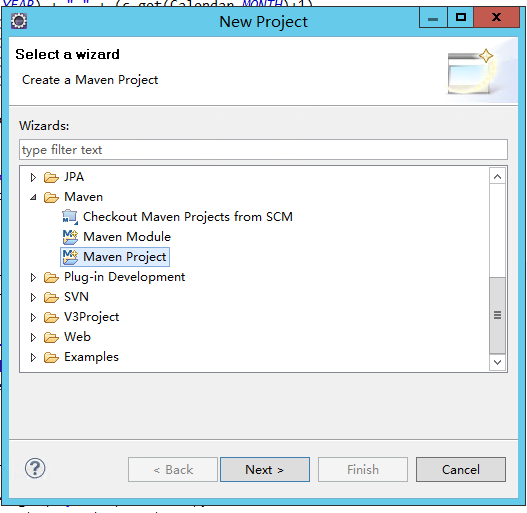

# V平台服务端规则/函数插件开发

## 简介

2次开发插件主要目的是扩展V平台的功能不足，更好的实现业务定制化。

规则和函数的开发过程基本一样的，有2点不同：实现接口不同，获取参数不同。

## 特点

开发过程完全按照java标准API开发，不需要关心V平台的API，只要实现入口接口即可。

可以自由使用IntelliJ IDEA 或者 Eclipse ，打包使用标准maven。

```java
/**函数接口*/
public interface IFunction {
	/** 
	 * 函数入口
	 * @param context 上下文对象
	 * @return 返回单值
	 */
	public Object evaluate(IFuncContext context) ;
}
```

```java
/** 二次开发规则接口*/
public interface IRule {
	/**
	 * 规则入口
	 * @param context 上下文对象
	 * @return 返回多值请返回Map,单值请返回Object
	 */
	public Object evaluate(IRuleContext context) ;
}

```

## maven配置

_maven不是必须的，但是没有它工作效率会比较低。_

#### 1.maven 的 settings.xml配置

在maven的conf目录，或者是Eclipse 的maven的配置

配置目的是从第3方的maven库下载V平台的2次开发接口，就是前面提到的 函数接口 IFunction ,规则接口 IRule

打开maven/settings.xml，找到profiles节点，复制下面的配置到profiles内。

```markup
		<!-- 嵌入到maven的settings.xml 这部分是必须的 -->
		<profile>
            <id>codingProxy</id>
            <activation>
                <activeByDefault>true</activeByDefault>
            </activation>
            <repositories>
                <repository>
                    <id>yindangu-v-devsuite-sdk-maven</id>
                    <name>maven</name>
                    <url>https://yindangu-maven.pkg.coding.net/repository/v-devsuite-sdk/maven/</url>
                    <releases>
                        <enabled>true</enabled>
                    </releases>
                    <snapshots>
                        <enabled>true</enabled>
                    </snapshots>
                </repository>
            </repositories>
        </profile>
		<!-- 嵌入到maven的settings.xml 这部分是必须的 -->
```

## 开始

### 创建标准maven项目




一直往下就成功创建标准的mavn项目了。如果有不清楚可以百度一下。

### 配置 pom.xml

#### V3入口依赖

配置 paas-extension构件

```markup
<dependency>
    <groupId>com.toone.v3.platform</groupId>
    <artifactId>paas-extension</artifactId>
    <version>3.3.0</version>
</dependency>
```

#### 导出依赖包（非必须）

把依赖的包导出来，方便发布构件时选择。在 build --&gt; plugins 节点下加入

```markup
<plugin><!-- 把依赖的包导出来，方便发布构件时选择 -->  
    <groupId>org.apache.maven.plugins</groupId>  
    <artifactId>maven-dependency-plugin</artifactId>  
    <executions>  
        <execution>
            <id>copy</id>  
            <phase>package</phase>  
            <goals>  
                <goal>copy-dependencies</goal>  
            </goals>  
            <configuration>  
                <outputDirectory>${project.build.directory}/lib</outputDirectory>  
            </configuration>  
        </execution>  
    </executions>  
</plugin>
```

#### 去除多余节点（非必须）

标准maven包含了一些多余的节点，可以去掉，例如：pluginManagement 节点

```markup
<pluginManagement>
    <plugins>
      ...
    </plugins>
  </pluginManagement>
```


